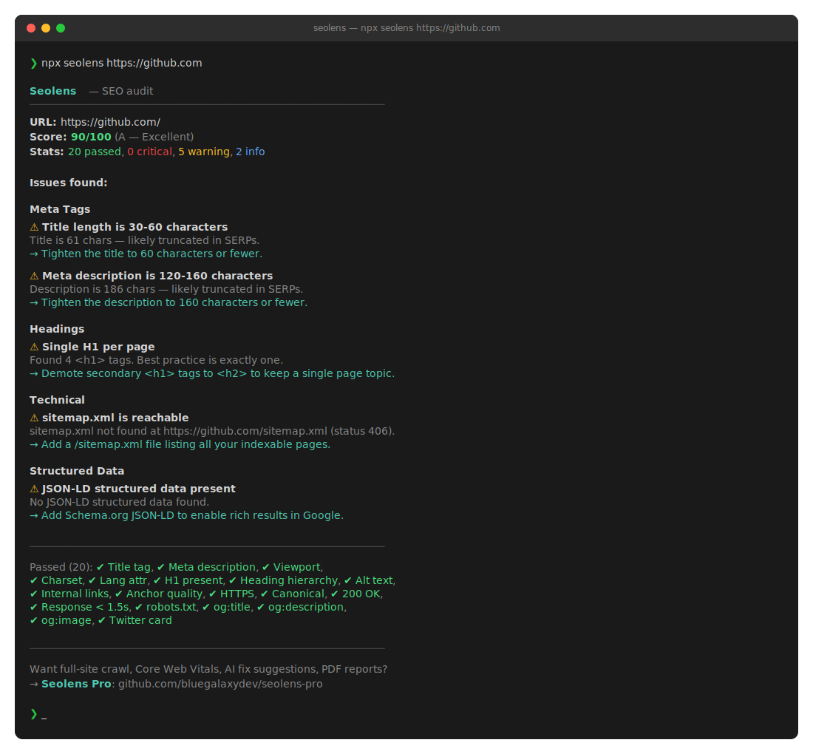

<div align="center">

# Seolens

**Fast, AI-friendly on-page SEO auditor. Score any URL in seconds.**

[](LICENSE)
[]()
[](https://github.com/bluegalaxydev/seolens)

```bash
npx seolens https://example.com
```



</div>

---

## What is Seolens?

Seolens is a **zero-config** SEO auditor that you run from your terminal, your CI pipeline, your IDE, or directly inside Claude. Point it at any URL and 5 seconds later you get a 0–100 score, a letter grade, and a prioritized list of fixes — each with a one-line "how to fix it" hint.

No login. No dashboard. No credit card. Just an audit.

```
  Seolens — SEO audit
  ────────────────────────────────────────────────────────────
  URL:    https://example.com
  Score:  72/100 (C — Fair)
  Stats:  18 passed, 2 critical, 4 warning, 1 info

  Issues found:

  Meta Tags
  ✖ Meta description present
     Page has no <meta name="description">.
     → Add a unique meta description summarizing the page in 120-160 chars.

  ⚠ Title length is 30-60 characters
     Title is only 18 chars (recommended: 30-60).
     → Expand the title to 30-60 characters with primary keywords near the front.

  Headings
  ✖ H1 heading present
     Page has no <h1>.
     → Add a single <h1> with the primary topic of the page.
  ...
```

## Why Seolens?

| | Seolens (free) | Screaming Frog | Ahrefs Site Audit | Semrush |
|---|---|---|---|---|
| Install in one command | ✅ `npx seolens` | ❌ desktop app | ❌ web only | ❌ web only |
| Runs in CI | ✅ exits non-zero on bad score | ❌ | ❌ | ❌ |
| Works offline as a skill | ✅ | ❌ | ❌ | ❌ |
| Open source | ✅ MIT | ❌ | ❌ | ❌ |
| Price | **Free forever** | $259/yr | $99/mo | $130/mo |

## Install

```bash
# One-off run (no install)
npx seolens https://example.com

# Global install
npm install -g seolens
seolens https://example.com

# As a library
npm install seolens
```

```js
import { audit, renderMarkdown } from 'seolens';

const result = await audit('https://example.com');
console.log(`Score: ${result.score.value}/100`);
console.log(renderMarkdown(result));
```

## Use cases

### 1. Audit on the command line
```bash
seolens https://example.com
```

### 2. Save a Markdown report
```bash
seolens https://example.com --out report.md
```

### 3. Generate a PowerPoint client report
```bash
seolens https://example.com --pptx report.pptx
```

A branded slide deck with cover, executive summary, score-by-category breakdown, one slide per issue with fix instructions, and a closing "what to do next" slide. Open it in PowerPoint, Keynote, or Google Slides — perfect for client deliverables.

### 4. Get JSON for further processing
```bash
seolens https://example.com --json | jq '.score'
```

### 5. Use as a Claude skill
Drop the repo into your Claude skills folder and ask:
> "Hey Claude, audit https://my-site.com for SEO issues"

Claude will run Seolens, parse the JSON, and explain results in plain English with prioritized fixes.

### 6. Use inside VS Code
Install the **[Seolens VS Code extension](https://github.com/bluegalaxydev/seolens/tree/main/vscode)**. Run `Seolens: Audit URL…` from the Command Palette and see results in a side panel — with one-click export to PowerPoint or Markdown.

### 7. Fail your CI build on regressions
```yaml
# .github/workflows/seo.yml
- run: npx seolens https://staging.example.com
  # Exits non-zero when score < 70
```

## What gets checked (free tier — 25 checks)

<table>
<tr>
<td valign="top">

**Meta Tags**
- Title tag present
- Title length 30-60 chars
- Meta description present
- Meta description length 120-160 chars
- Mobile viewport meta tag
- Character encoding declared
- HTML lang attribute

**Headings**
- H1 heading present
- Single H1 per page
- Heading hierarchy well-formed
- H1 content meaningful

**Images**
- All images have alt text
- Images have width/height

</td>
<td valign="top">

**Links**
- Page has internal links
- Anchor text descriptive
- External links have `rel`

**Technical**
- HTTPS
- Canonical URL declared
- Page returns 200 OK
- Response time under 1.5s
- robots.txt reachable
- sitemap.xml reachable

**Social**
- Open Graph title
- Open Graph description
- Open Graph image
- Twitter card type

**Structured Data**
- JSON-LD present
- JSON-LD parses correctly

</td>
</tr>
</table>

## Want more? → Seolens Pro

The free version audits one URL with 25 checks. **Seolens Pro** adds:

- 🕷️ **Full-site crawl** — audit thousands of pages with one command
- ⚡ **Core Web Vitals** — LCP, CLS, INP measurement
- 🌍 **hreflang validation** for international sites
- 🤖 **AI-powered fix suggestions** — not just "title is missing", but "recommended title: '...'"
- 📄 **White-label PDF reports** for client deliverables
- 🔔 **Scheduled monitoring** — get alerts when scores drop
- 🧠 **80+ advanced checks** — schema depth, internal linking analysis, content gap detection

→ **[Get Seolens Pro](https://github.com/bluegalaxydev/seolens-pro)** *(coming soon)*

## CLI reference

```
Usage:
  seolens <url>                  Run audit, print colored terminal report
  seolens <url> --markdown       Print Markdown report to stdout
  seolens <url> --json           Print full JSON results
  seolens <url> --out FILE       Save Markdown report to FILE
  seolens <url> --pptx FILE      Save PowerPoint (.pptx) report to FILE
  seolens --version              Show version
  seolens --help                 Show this help

Exit codes:
  0   Score >= 70
  1   Score < 70 (useful in CI)
  2   Error during audit
```

## Library API

```ts
audit(url: string, options?: {
  timeout?: number;     // ms, default 15000
  onProgress?: (current, total, checkId) => void;
}): Promise<AuditResult>

interface AuditResult {
  url: string;
  score: { value: number; grade: 'A'|'B'|'C'|'D'|'F'; label: string };
  summary: { passed: number; critical: number; warning: number; info: number; skipped: number };
  results: CheckResult[];
}

renderMarkdown(audit: AuditResult): string
renderTerminal(audit: AuditResult): string
```

## Roadmap

- [x] 25 core on-page checks
- [x] CLI with colored output
- [x] Markdown + JSON output
- [x] Claude skill manifest
- [ ] VS Code extension wrapper *(in progress)*
- [ ] Sitemap-driven multi-page audit (Pro)
- [ ] Core Web Vitals integration (Pro)

## Contributing

Pull requests welcome — for new checks, please add a corresponding entry under `src/checks/`. By contributing you agree to the [Contributor License Agreement](CONTRIBUTING.md).

## License

MIT © 2026 [bluegalaxydev](https://github.com/bluegalaxydev)

---

<div align="center">

If Seolens saves you time, **please ⭐ star the repo** — it's the easiest way to support the project.

[Report a bug](https://github.com/bluegalaxydev/seolens/issues) · [Request a check](https://github.com/bluegalaxydev/seolens/issues/new?template=new-check.md) · [Seolens Pro](https://github.com/bluegalaxydev/seolens-pro)

</div>
